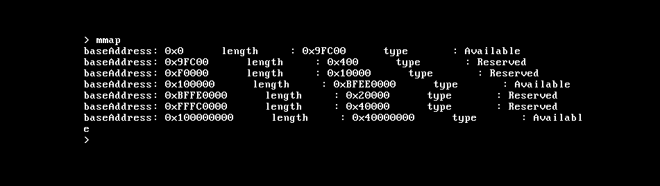
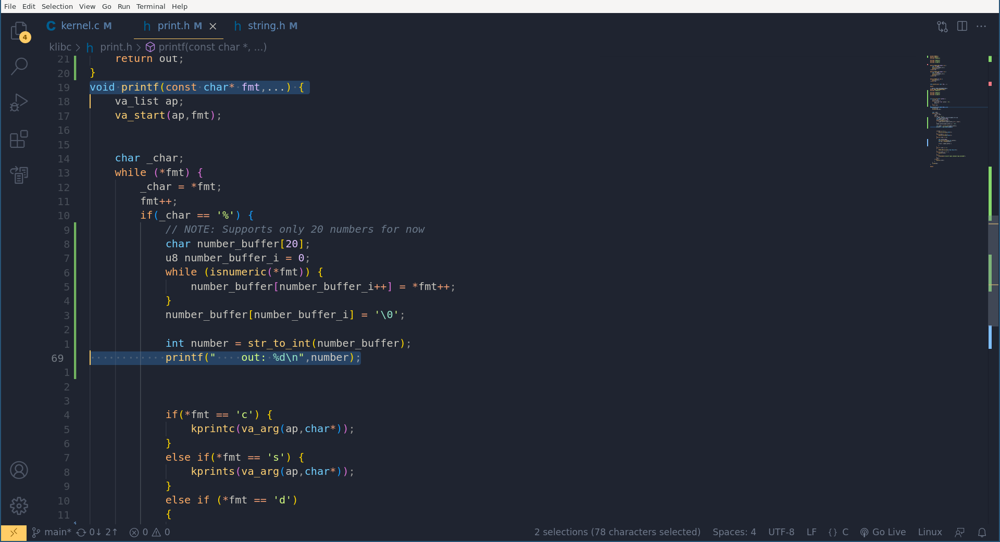
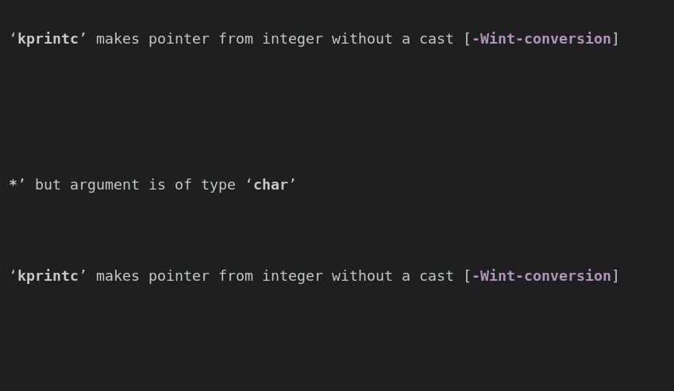

# Doors OS
Hobbiest OS am devloping from scratch to understand low lvl programming and sys dev       
it will take as long as it needs to take

## How To Run
-   install nasm => ```apt install nasm```
-   install qemu => ``` apt install qemu-system-i386```
-   run make

## Goals
after reading the [beginner mistakes](https://wiki.osdev.org/Beginner_Mistakes) and testing a bit in my [leanring repo](https://github.com/t-88/Code-Bongo-III/tree/main/os-dev), i knew i needed a end goal and i should do it the right way   
- [x] getting keyboad input 
- [x] mouse Input 
- [x] VGA driver 
- [x] building a repl (read excute print loop) 
- [ ] making some game 
and the most important goal is to learn and explore     


## Dev Imgs
### Memory Maping

### Terminal Achived

#### Mouse Driver

#### Basic interface


### Kinda Funny
#### Printing Inside Print :O

#### Printing Os Memery


## Credits
-   ctr-c ctr-v from [cfenollosa os dev](https://github.com/cfenollosa/os-tutorial/tree/master)
-   ofc [os-dev](https://wiki.osdev.org/Expanded_Main_Page) 

### License
[](https://choosealicense.com/licenses/mit/)